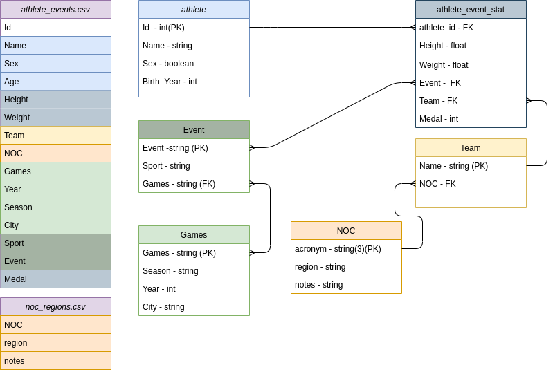

# ps_celero_2021

Projeto desenvolvido para o processo seletivo da Celero em junho de 2022.

- Especificação do projeto em *Celero_BackEnd.pdf*

- Requerimentos de pacotes python em *requeriments.txt*

## Diagrama de Banco de dados 

*As cores no diagrama mostram a transformação dos CSV's originais em novas tabelas.

**obs.:** Ainda poderia ser separado as estatisticas pessoais do atleta (peso, altura) da estatisticas relativas ao evento (time e medalha), uma vez que o mesmo atleta pode estar competindo em diferentes eventos(no mesmo jogo olimpico) com as mesmas estatisticas pessoais. Porém isso agregaria uma complexidade maior ao código e ao banco de dados que talvez prejudicaria na manutenção e até no desempenho(por exesso de joins).

## Utilizando o projeto
Configure o ambiente de desenvolvimento instalando as dependencias em **requeriments.txt**

No diretório **./ps_celero/** use o script *rebase.sh* no terminal (não esqueça de dar permição de execução com chmod):

<pre><code>
./rebase.sh
</code></pre>

A seguir, se quiser popular a base de dados, verifique se os arquivos *athlete_events.csv* e *noc_regions.csv* na raiz do projeto e execute:
<pre><code>
python manage.py shell -c 'exec(open("populate.py").read())'
</code></pre>

Por fim, inicie o servidor:
<pre><code>
python manage.py runserver
</code></pre>

## Sobre a implementação 
Como eu não havia experiencia de mercado com Django, tive de aprender o framework para tal projeto.

### Tarefas 
- [X] Criar os modelos para guardar as informações no BD.
- [X] Rotina para popular o BD com o CSV.
- [ ] *Criar Rotas de iteração (leitura, listagem, atualização, criação e deleção)
- [X] Documentação.

*Como tive diversos compromissos com a faculdade e com o atual trabalho nesta semana, não consegui concluir todas as rotas desejadas para a API, porém fiz o pedido para uma classes/modelos criados. O mesmo serve para a documentação

**Extras:**
- [ ] Testes Unitarios;
- [ ] Filtros na Listagem;
- [X] Diagrama Relacional do BD;
- [ ] Hospedar a API em Servidor.

### Postman

As especificações e testes das rotas foram feitos através do aplicativo Postman.

- [Link para workspace Postman](https://app.getpostman.com/join-team?invite_code=3f573f4958b5437dfacfea922c3a8876&ws=4531e594-afd1-4f1c-85a2-1ebefbb28031)

**Referencias utilizadas :**
https://www.django-rest-framework.org/tutorial/quickstart/
https://dev.to/nobleobioma/build-a-crud-django-rest-api-46kc