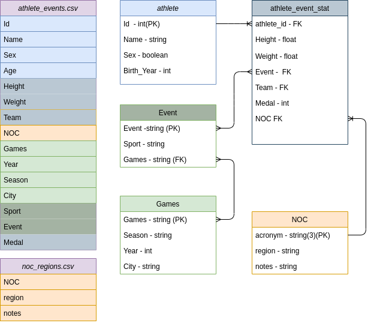

# ps_celero_2021

Projeto desenvolvido para o processo seletivo da Celero em junho de 2022.

- Especificação do projeto em *Celero_BackEnd.pdf*

- Requerimentos de pacotes python em *requeriments.txt*
## Tarefas 
- [ ] Criar os modelos para guardar as informações no BD.
- [ ] Criar Rotas de iteração (leitura, listagem, atualização, criação e deleção)
- [ ] Rotina para popular o BD com o CSV.
- [ ] Documentação

**Extras:**
- [ ] Testes Unitarios;
- [ ] Filtros na Listagem;
- [ ] Diagrama Relacional do BD;
- [ ] Hospedar a API em Servidor.

## Diagrama de Banco de dados 

*As cores no diagrama mostram a transformação dos CSV's originais em novas tabelas.

**obs.:** Ainda poderia ser separado as estatisticas pessoais do atleta (peso, altura) da estatisticas relativas ao evento (time e medalha), uma vez que o mesmo atleta pode estar competindo em diferentes eventos(no mesmo jogo olimpico) com as mesmas estatisticas pessoais. Porém isso agregaria uma complexidade maior ao código e ao banco de dados que talvez prejudicaria na manutenção e até no desempenho(por exesso de joins).

##Sobre a implementação 
Como eu não havia experiencia de mercado com Django, tive de aprender o framework para tal projeto.

**Referencias utilizadas :**
https://www.django-rest-framework.org/tutorial/quickstart/
https://dev.to/nobleobioma/build-a-crud-django-rest-api-46kc